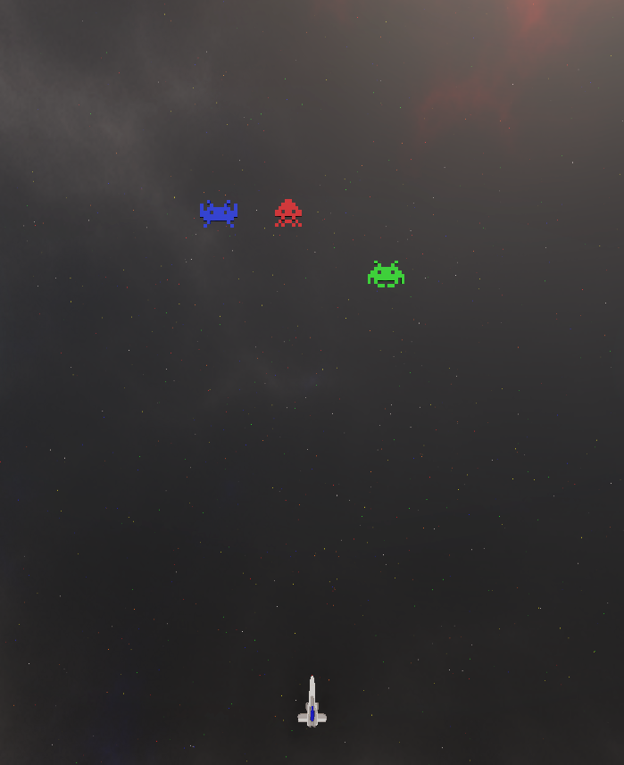

# MicroGestures AR Game

[](https://opensource.org/licenses/MIT)
[](https://unity.com/)
[](https://www.meta.com/quest/)
[]()

An augmented reality arcade-style shooter game utilizing Meta's MicroGestures technology for intuitive hand-based controls on Meta Quest 3.



*Game view from Unity editor*

https://github.com/user-attachments/assets/838b3d6b-822a-4b1c-91fa-893b7e3feee0

*Player interacting with the game using MicroGestures at the university showcase*

## 📖 About

This AR game was developed as an interactive demonstration for the Grupo de Tecnologías Inmersivas (GTI) at Facultad de Ingeniería - Universidad Nacional de Entre Ríos (UNER). The project showcases the potential of Meta's MicroGestures API for creating intuitive, controller-free AR gaming experiences.

The game features a vertical arcade-style display that follows the player's hand in physical space, allowing them to control a spaceship and shoot descending enemies using only natural hand gestures—no controllers required.

**Developed by**: Lucio Sepúlveda  
**Research Group**: [GTI - Grupo de Tecnologías Inmersivas](https://www.instagram.com/gti.fiuner/)  
**Laboratory**: CIRINS - Centro de Ingeniería en Rehabilitación e Investigaciones Neuromusculares y Sensoriales  
**Year**: 2025

## 🎮 Gameplay

### Game Mechanics

Players control a spaceship to shoot colored enemies that descend from the top of the screen in classic arcade fashion. The game screen is a large vertical display that spatially tracks the player's hand in AR space.

### MicroGestures Controls

The game utilizes [Meta's MicroGestures API](https://developers.meta.com/horizon/documentation/unity/unity-microgestures/) for completely controller-free interaction:

- **Swipe Left/Right**: Move the spaceship horizontally
- **Double Swipe (same direction)**: Perform a dash in that direction
- **Tap/Pulse**: Fire weapons

All gestures are performed with natural hand movements, detected by the Quest 3's advanced hand tracking.

## ✨ Features

- **Controller-Free Gameplay**: Entirely gesture-based controls using Meta MicroGestures
- **Hand-Tracking Display**: Game screen follows player's hand in AR space
- **Intuitive Gestures**: Natural swipe and tap movements for game control
- **AR Integration**: Blends virtual gameplay with physical environment
- **Dash Mechanic**: Quick evasive movements via double-swipe gesture
- **Vertical Display Format**: Smartphone-inspired aspect ratio for comfortable viewing

## 🎯 Project Purpose

This prototype was created to:
- Demonstrate Meta Quest 3's MicroGestures capabilities
- Explore controller-free AR gaming interactions
- Showcase immersive technology research at GTI
- Provide an engaging interactive exhibit for university events
- Validate gesture-based control schemes for AR applications

## 🛠️ Technology Stack

- **Game Engine**: Unity 6000.3.2f1
- **AR Framework**: Meta XR All-in-One SDK
- **Gesture System**: Meta MicroGestures API
- **Platform**: Meta Quest 3
- **Language**: C#

## 📁 Repository Structure
```
microgestures-ar-game/
├── Assets/              # Unity assets, scripts, scenes, and resources
├── ProjectSettings/     # Unity project configuration
└── Packages/           # Unity package dependencies
```

## 🚀 Getting Started

### Prerequisites

- Unity 6000.3.2f1 or compatible version
- Meta XR All-in-One SDK
- Meta Quest 3
- Meta Quest Developer Hub or Meta Quest app in Developer Mode

### Installation

1. Clone the repository:
```bash
git clone https://github.com/Lucio-Sepulveda/microgestures-ar-game.git
cd microgestures-ar-game
```

2. Open the project in Unity 6000.3.2f1

3. Ensure Meta XR All-in-One SDK is properly imported

4. Connect your Meta Quest device in Developer Mode

5. Build and deploy to your Quest device via Unity

### Running the Game

1. Enable Developer Mode on your Meta Quest device through the Meta Quest mobile app
2. Connect your headset to your computer
3. Build and Run from Unity
4. Follow on-screen AR passthrough instructions
5. Use hand gestures to play!

## 🎓 Research Context

**Grupo de Tecnologías Inmersivas (GTI)**  
Facultad de Ingeniería - Universidad Nacional de Entre Ríos

GTI is a research group focused on exploring the intersection of virtual reality, augmented reality, science, education, health, and creativity. The group designs and develops immersive experiences that connect technology with people, from surgical simulators to experimental games.

This project was showcased at the Faculty of Engineering's career fair as a demonstration of cutting-edge AR technology and gesture-based interaction research.

## 🔄 Project Status & Roadmap

**Current Status**: Functional AR gesture-controlled prototype

**Completed**:
- [x] MicroGestures integration
- [x] Hand-tracking display system
- [x] Swipe-based movement controls
- [x] Dash mechanic
- [x] Tap-to-shoot functionality
- [x] Enemy spawning system
- [x] AR passthrough integration

**In Development**:
- [ ] Enemy attack system
- [ ] Player health/damage mechanics
- [ ] Scoring system
- [ ] Progressive difficulty
- [ ] Visual and audio feedback improvements
- [ ] Game over/restart flow

## 💡 Technical Highlights

### MicroGestures Implementation

This project leverages Meta's cutting-edge MicroGestures API, which enables:
- Low-latency gesture recognition
- Natural hand pose detection
- Controller-free AR interaction
- Minimal hand fatigue through optimized gesture vocabulary

### AR Display Tracking

The game screen spatially anchors to the player's hand, creating an innovative "handheld screen" effect that:
- Follows hand position and rotation
- Maintains comfortable viewing distance
- Provides intuitive spatial reference
- Enables natural gameplay posture

## 🎮 Design Philosophy

This prototype prioritizes:
- **Accessibility**: No controllers or complex input schemes required
- **Intuitiveness**: Gestures mirror natural hand movements
- **Demonstration**: Quick, engaging sessions suitable for public showcases
- **Innovation**: Exploration of emerging AR interaction paradigms

## ⚙️ Platform Notes

- **Optimized for Meta Quest 3**: Full AR passthrough and advanced hand tracking
- Requires sufficient lighting for optimal hand tracking performance

## 📄 License

This project is licensed under the MIT License - see the LICENSE file for details.

## 🔗 Links

- [Meta MicroGestures Documentation](https://developers.meta.com/horizon/documentation/unity/unity-microgestures/)
- [Meta XR All-in-One SDK](https://developer.oculus.com/downloads/package/meta-xr-sdk-all-in-one-upm/)
- [GTI - Grupo de Tecnologías Inmersivas](https://www.instagram.com/gti.fiuner/)
- [Unity XR Documentation](https://docs.unity3d.com/Manual/XR.html)

## 🙏 Acknowledgments

- **GTI Team**: Grupo de Tecnologías Inmersivas for collaborative environment and showcase opportunities
- **CIRINS Laboratory**: For research infrastructure and support
- **Meta**: For MicroGestures API and comprehensive XR development tools
- **Facultad de Ingeniería - UNER**: For providing the platform to demonstrate immersive technologies

---

*Developed by GTI - Grupo de Tecnologías Inmersivas | Facultad de Ingeniería - UNER (2025)*
